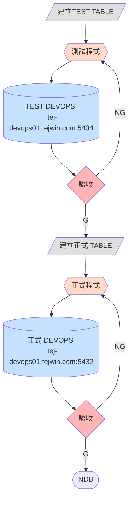
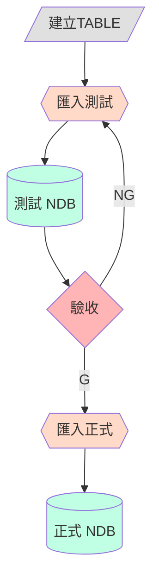

#### DB flow

```mermaid
flowchart TD
A[/建立TEST TABLE /] 
B[/建立正式 TABLE /] 

df1[(TEST DEVOPS \n tej-devops01.tejwin.com:5434)]
df2[(正式 DEVOPS \n tej-devops01.tejwin.com:5432)]

p1{{測試程式}}
p2{{正式程式}}
E([NDB])

ok{驗收}
ok2{驗收}


style A stroke:#333,stroke: 5, 5,fill:#E0E0E0
style B stroke:#333,stroke: 5, 5,fill:#E0E0E0
style df1 stroke:#333,stroke: 5, 5,fill:#C4E1FF
style df2 stroke:#333,stroke: 5, 5,fill:#C4E1FF
style p1 stroke:#333,stroke: 5, 5,fill:#FFDAC8
style p2 stroke:#333,stroke: 5, 5,fill:#FFDAC8
style ok stroke:#333,stroke: 5, 5,fill:#FFB5B5
style ok2 stroke:#333,stroke: 5, 5,fill:#FFB5B5

A--> p1-->df1 --> ok --G-->B-->p2--> df2 
ok --NG--> p1
df2 --> ok2 --G-->E
ok2 --NG-->p2
```

```mermaid
flowchart TD
A[/建立TABLE /] 

df3[(測試 NDB)]
df4[(正式 NDB)]

p1{{匯入測試}}
p2{{匯入正式}}

ok{驗收}

style A stroke:#333,stroke: 5, 5,fill:#E0E0E0
style df3 stroke:#333,stroke: 5, 5,fill:#C1FFE4
style df4 stroke:#333,stroke: 5, 5,fill:#C1FFE4
style p1 stroke:#333,stroke: 5, 5,fill:#FFDAC8
style p2 stroke:#333,stroke: 5, 5,fill:#FFDAC8
style ok stroke:#333,stroke: 5, 5,fill:#FFB5B5

A--> p1-->df3 --> ok --G-->p2--> df4
ok --NG--> p1

```